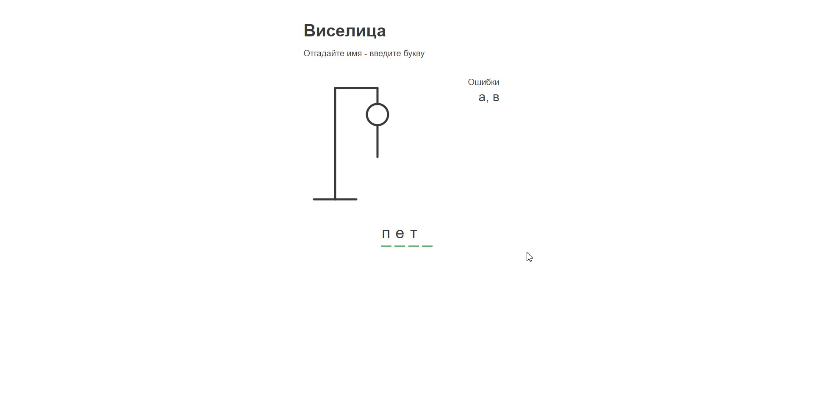

# Hangman (Виселица) - угадай имя

Проект на Vue 3 (Composition API) и TypeScript.



## Верстка

Разметка и стили лежат в папке layout

## Стек

- Vue 3 (Composition API)
- TypeScript
- HTML
- CSS
- Axios

## Project Setup

```sh
npm install
```

### Compile and Hot-Reload for Development

```sh
npm run dev
```

### Type-Check, Compile and Minify for Production

```sh
npm run build
```

### Lint with [ESLint](https://eslint.org/)

```sh
npm run lint
```
